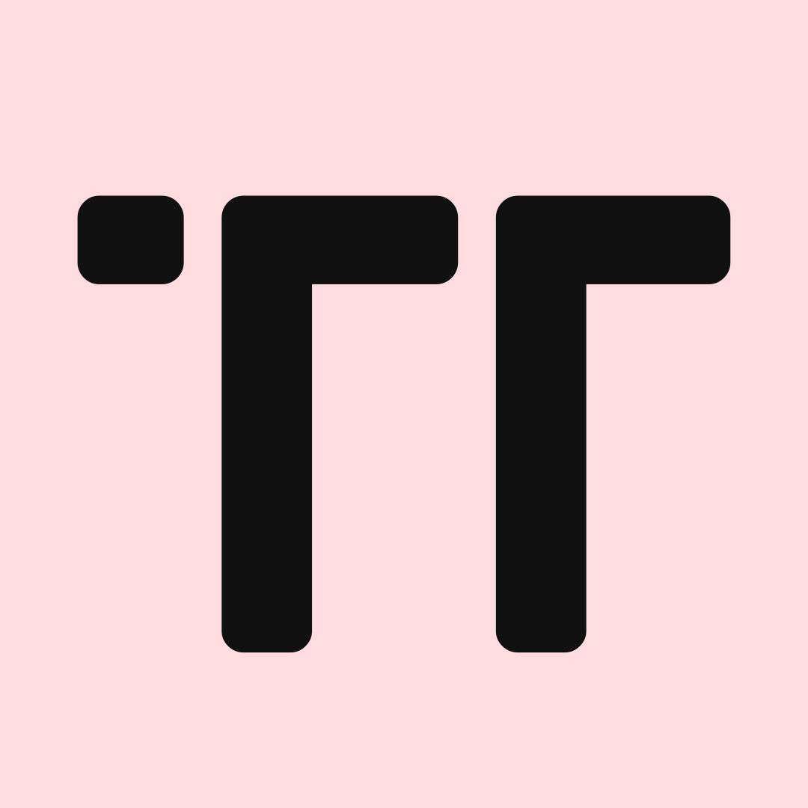

 

  

  <h3 align="center">Trend Thread</h3>

  

    A fully interactive webshop built with the MERN stack.
     
    <a href=""><strong>Explore the docs »</strong></a>
     
     
    <a href="https://trendthreadshop.com">View Demo</a>
  

## About The Project

### Built With

This section should list any major frameworks/libraries used to bootstrap your project. Leave any add-ons/plugins for the acknowledgements section. Here are a few examples.

* [![React][React.js]][React-url]
* [![Bootstrap][Bootstrap.com]][Bootstrap-url]
* [![TypeScript][TypesSript.com]][TypeScript-url]

(<a href="#readme-top">back to top</a>)

[React.js]: https://img.shields.io/badge/React-20232A?style=for-the-badge&logo=react&logoColor=61DAFB
[React-url]: https://reactjs.org/
[Bootstrap.com]: https://img.shields.io/badge/Bootstrap-563D7C?style=for-the-badge&logo=bootstrap&logoColor=white
[Bootstrap-url]: https://getbootstrap.com
[TypeScript.com]: https://img.shields.io/badge/TypeScript-007acc?style=for-the-badge&logo=typescript&logoColor=white
[TypeScript-url]: https://www.typescriptlang.org
